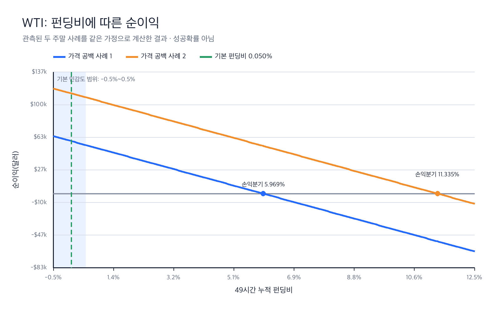
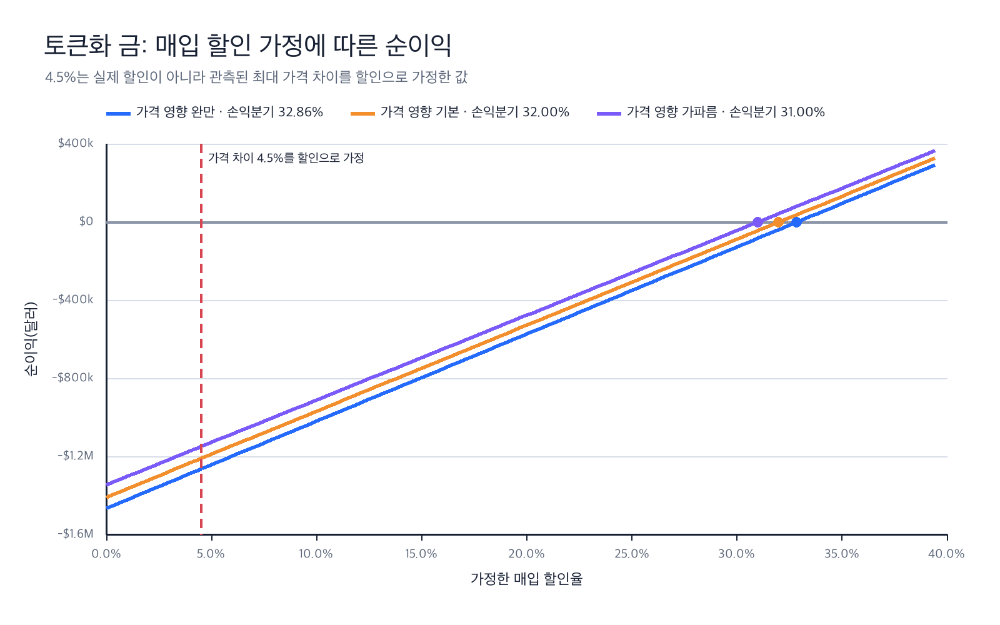
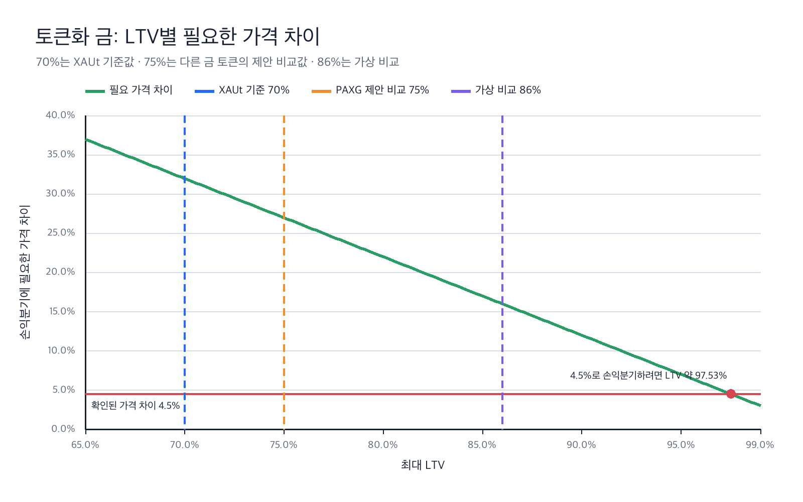
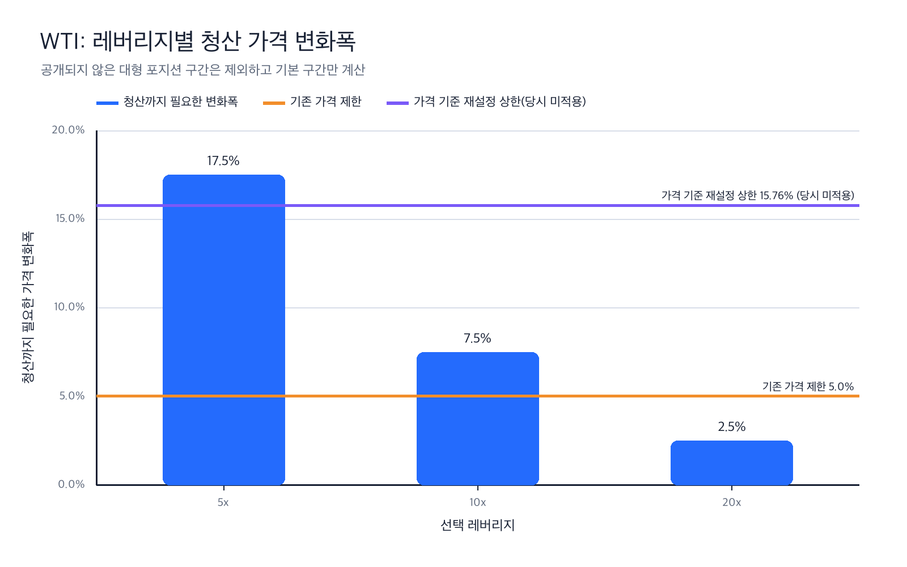

# 원자재 시나리오 시뮬레이션

이 패키지는 WTI·토큰화 금·천연가스 시나리오의 경제적 조건을 검증하는 공개 모델입니다. 세 시나리오의 공통 질문은 **체인이 정상 작동하더라도, 체인이 참조하는 가격과 실제 위험을 보여주는 시장 가격이 어긋나면 경제적 위험이 남는가**입니다. WTI와 금은 이 차이가 특정 조건에서 경제적 이익으로 이어지는지 계산하고, 천연가스는 실제 노출과 다른 벤치마크를 선택한 문제를 진단합니다. 세 모델을 하나의 공격 수익 모델로 묶지는 않습니다.

```text
rwa_market_gap/commodity_simulation/
data/commodity_simulation/
tests/commodity_simulation/
```

검증되지 않은 공격 성공확률이나 배포자 공격 결과는 공개 모델에 포함하지 않습니다.

## 달라진 원칙

| 초기 구현 | 검토 반영본 |
|---|---|
| 방향 일치율을 성공확률 입력으로 사용 | 관측 통계로만 보존하고 성공확률은 `None` |
| 두 스트레스 사건을 몬테카를로 재표본추출 | 각 관측 사건의 사후 손익을 개별 계산 |
| 명목금액에 손익이 선형 비례 | 용량 상한과 규모 의존 슬리피지로 실행 가능 금액 제한 |
| 역방향 손실을 증거금에서 단순 절단 | 호가·청산 경로 근거가 없으면 `UnsupportedModel`로 차단 |
| 펀딩을 항상 비용으로 처리 | 양수는 지급, 음수는 수취로 처리 |
| 펀딩 크기를 가정값으로만 사용 | 순이익을 0으로 만드는 펀딩률을 폐형식으로 출력 |
| 금 체결비용이 규모와 독립 | 관측 유동성 점을 지나는 파워법칙 시장충격 민감도 |
| 천연가스 달러 추적오차 즉시 출력 | 사건 시작·종료일이 없으면 달러 환산 차단 |
| 격리 마진이면 백스톱이 없다고 추론 | 마진 모드는 청산 대상 담보 범위만 구분하고 백스톱·ADL은 사건 자료가 없으면 미확인 |
| 0.5% 갱신을 선형 합산하여 25회 | 복리 갱신으로 23회 |
| `49시간`·`6%`를 코드에 하드코딩 | 원장 레코드에서 로드하고 6%는 평균 교환 영향의 상한 프록시로 해석 |
| 민감도 표에 값이 평평한 행이 그대로 노출 | 비활성 사유를 함께 출력하고 테스트로 강제 |

## 공시 파라미터 메커니즘

`market_mechanics.py`의 밴드 항등식과 리앵커 상태기계는 A등급 공시 파라미터를 사용한 결정론적 재현입니다. WTI 사건 대조에는 B등급 관측값을 사용하며, 공개되지 않은 마진 티어는 모델링하지 않습니다. 비용 가정과 공격자 모델은 이 모듈에 포함하지 않습니다.

### 밴드 항등식

공시된 밴드 폭이 최대 레버리지의 역수와 정확히 일치합니다.

| 시장 | 최대 레버리지 | 밴드 | 1 / 최대 레버리지 | 오차 |
|---|---:|---:|---:|---:|
| GOLD | 25배 | 4.00% | 4.00% | 0 |
| WTIOIL | 20배 | 5.00% | 5.00% | 0 |
| NATGAS | 10배 | 10.00% | 10.00% | 0 |
| SILVER | 25배 | 4.00% | 4.00% | 0 |
| BRENTOIL | 20배 | 5.00% | 5.00% | 0 |

최대 레버리지 포지션이 증거금을 전부 소진하는 이동폭도 `1 / 최대 레버리지`이므로, **밴드 상한과 파산선이 같은 수**입니다.

### 공시 예시 재현

리앵커 상태기계를 순차 실행하면 공시 문서의 예시가 그대로 나옵니다.

```text
기준가 100.00, 밴드 5%, 리셋 2회
  단조 상승 → 115.7625  (공시 +15.76%)
  단조 하락 →  85.7375  (공시 -14.26%)
```

상태기계는 경로 의존적이라 종착 가격만으로 마크를 복원할 수 없습니다. 같은 종착가 112.00에서도 경로에 따라 결과가 달라집니다.

| 경로 | 유효 마크 | 상방 리셋 | 하방 리셋 |
|---|---:|---:|---:|
| 단조 상승 | 112.00 | 2 | 0 |
| 톱니 후 상승 | 109.97 | 2 | 1 |

### 밴드는 중간 레버리지만 보호합니다

유지증거금은 **선택 레버리지가 아니라 시장 최대 레버리지**로 고정됩니다.

```text
유지증거금률 = 0.5 / 최대 레버리지 = 2.5%   (WTIOIL, 선택 레버리지와 무관)
청산 역행폭   = 1 / 선택 레버리지 - 2.5%
```

| 선택 레버리지 | 청산 역행폭 | 정적 밴드(5%) | 리앵커 캡(15.76%) |
|---:|---:|---|---|
| 20배 | 2.50% | 안쪽 → **공백 중에도 청산** | 안쪽 |
| 10배 | 7.50% | 바깥 → 보호 | 안쪽 |
| 5배 | 17.50% | 바깥 → 보호 | 바깥 → 보호 |

유지증거금을 선택 레버리지로 계산하는 잘못된 모델은 10배를 5.00%, 5배를 10.00%로 계산해 **보호 구간 판정이 뒤집힙니다.** 이 반례를 테스트로 고정했습니다.

공개된 마진 티어가 없어 기본 티어만 계산하며, `margin_tiers_modelled=False`로 표시합니다. 대형 포지션은 더 일찍 청산될 수 있습니다.

### 2차 스트레스 주말 대조

```text
CME 비교용 종가                  91.35
장소별 밴드 기준가(역산)          91.2695
관측된 정적 밴드 상한             95.833
리앵커 캡(반사실)                105.656
외부 재개가                     106.89   → 반사실 리앵커 캡도 초과
```

`91.35`달러는 CME 비교 기준이며 장소별 디스커버리 바운드 기준가가 아닙니다. 공급된 보고서가 `95.833`달러를 해당 장소의 5% 정적 상한으로 설명하므로, 장소별 기준가는 `95.833 / 1.05`로 역산합니다. 리앵커가 사건 당시 활성이 아니었다는 사실은 원장의 `reanchor_active_during_event=false`로 기록되어 있고 테스트로 고정했습니다.

금요일 종가를 공통 기준으로 두면 온체인 마크와 외부시장 재개가 사이의 수익률 차이는 `(106.89 - 95.833) / 91.35 = 12.10%p`입니다. 같은 사건의 24시간 관측치는 숏 청산 약 **3,690만 달러**, 롱 청산 약 **210만 달러**로 숏이 약 **17.6배** 컸습니다. 이는 가격 충격과 포지션 쏠림의 규모를 보여주는 보조 자료일 뿐, 이 모델의 공격 수익·실제 체결·펀딩 실패·ADL 발생을 입증하지 않습니다. ([CoinDesk 사건 보도](https://www.coindesk.com/markets/2026/03/09/oil-shorts-on-hyperliquid-get-wiped-out-as-crude-surges-30-on-iran-escalation-triggering-usd40-million-in-liquidations))

## WTI: 스트레스 사건별 사후 기회

WTI 결과는 공격 성공률이 아니라 다음 조건의 **사후 전략 손익**입니다.

49시간 보유 구간은 [CME의 WTI 정규 거래시간](https://www.cmegroup.com/education/courses/introduction-to-energy/introduction-to-crude-oil/wti-overview)에 따른 금요일 16:00 CT부터 일요일 17:00 CT까지의 표준 주말 휴장 구간이며, 휴일은 별도로 다뤄야 합니다.

1. 온체인 마크가 움직인 방향을 확인한 뒤 같은 방향으로 진입한다.
2. 해당 마크에서 가정한 물량을 체결할 수 있다.
3. 외부시장 재개 가격에서 포지션을 종료할 수 있다.

기본 C등급 가정은 요청 명목 100만 달러, 실행 용량 100만 달러, 할당 증거금 10만 달러입니다. 할당 증거금은 전체 교차마진 계좌의 재구성이 아닙니다. 슬리피지는 용량 사용률의 파워법칙으로 계산하며, 기본 지수 1에서는 총 슬리피지 비용이 명목금액에 대해 이차로 증가합니다. 용량·곡선 모두 실제 사건 호가장이 없는 C등급 가정입니다.

| 사건 | 진입 마크 대비 재개수익률 | PfC | CoC | 순이익 |
|---|---:|---:|---:|---:|
| 1차 스트레스 주말 | 6.17% | $61,721 | $2,528 | $59,193 |
| 2차 스트레스 주말 | 11.54% | $115,378 | $2,528 | $112,850 |

이 값은 진입·청산 실행 가능성이 확인된 실현 공격 수익이 아닙니다. 89.9% 방향 일치 관측은 결과에 곱하지 않으며 `success_probability=None`을 유지합니다.

### 용량 제한

기본 용량 가정이 100만 달러이므로 요청액을 1,000만 달러로 올려도 실행 명목과 순이익은 100만 달러 사례에서 더 증가하지 않습니다. 상한 안에서는 주문 규모가 커질수록 슬리피지율도 상승합니다. 이 상한과 곡선 자체는 실측값이 아니며 실제 사건 호가장이 확보되면 교체해야 합니다.

### 펀딩 손익분기

무기한 선물에서 지속적인 베이시스를 소거하는 장치는 펀딩입니다. 따라서 중요한 값은 가정한 펀딩 **비용**이 아니라, 이 상태의 순이익을 0으로 만드는 펀딩 **수준**입니다.

`funding_receipt - funding_payment = -명목 × f` 를 `순이익 = PfC - CoC` 에 대입하면 펀딩 항이 하나의 부호 있는 현금흐름으로 합쳐지고, 나머지 항은 `f`와 무관합니다.

```text
순이익(f) = 실현이익 - 수수료 - 슬리피지 - 자본비용 - 명목 × f

f* = (실현이익 - 수수료 - 슬리피지 - 자본비용) / 명목
```

`f*`는 고정 명목·고정 보유기간·중간 청산 없음이라는 조건에서의 폐형식 해이며, 가정한 펀딩률과 무관하게 같은 값이 나옵니다. 음수면 펀딩을 **수취**해야만 손익분기에 도달한다는 뜻입니다.

| 사건 | 손익분기 펀딩 (49시간 가정) | 단순 시간당 평균 | 원장 가정값 | 배수 |
|---|---:|---:|---:|---:|
| 1차 스트레스 주말 | 5.969% | 0.1218% | 0.050% | 119.4배 |
| 2차 스트레스 주말 | 11.335% | 0.2313% | 0.050% | 226.7배 |

이 값의 의미는 두 가지입니다.

1. **민감도 스윕만으로는 결론을 뒤집을 수 없습니다.** 원장의 펀딩 민감도 상한은 `±0.5%/49시간`인데, 손익분기는 1차 사건에서 그 **11.9배**, 2차 사건에서 **22.7배**입니다. 즉 선언된 가정 구간 안에서는 어떤 값을 넣어도 부호가 바뀌지 않습니다. 이 사실 자체를 테스트로 고정했습니다.
2. **따라서 주장의 형태가 바뀝니다.** *"이 상태는 수익성이 있다"* 가 아니라 *"고정 명목과 49시간 보유를 가정하면 누적 지급 펀딩 11.3%에서 손익분기한다"* 는 **조건부 반증 명제**가 됩니다.

실제 거래소 펀딩이 이 수준에 도달했는지는 **본 모델이 확인하지 않습니다.** 사건 당시 펀딩 이력이 확보되면 이 표와 직접 대조해야 하며, 그것이 이 시나리오의 가장 중요한 미확보 자료입니다.

### 지원하지 않는 WTI 경로

제공된 두 사건은 모두 온체인 마크가 가리킨 방향과 외부시장 재개 방향이 일치합니다. 반대 방향 경로에는 사건 당시 호가, 청산 시점, 부분 체결, 백스톱 자료가 없습니다. 따라서 수정본은 청산 손실을 임의로 만들지 않고 `UnsupportedModel`을 반환합니다. `mark == close`처럼 방향 신호가 없는 경우도 거래를 만들지 않습니다.

### capital_at_risk의 의미가 시나리오마다 다릅니다

| 모델 | `capital_at_risk` | 의미 |
|---|---:|---|
| WTI | $100,000 | 전략에 할당한 증거금. 전체 교차계좌 재구성값이 아님 |
| 금 | 약 $4,153,887 | 담보 매입에 **이미 지출한** 금액 |

금 모델의 값은 CoC(약 $4,154,787)와 거의 같습니다. 담보를 사는 순간 현금이 나가기 때문이며 회계 항등식에는 영향이 없습니다. 다만 **두 숫자를 같은 표에 나란히 놓거나 합산하면 안 됩니다.** 성격이 다른 양입니다.

## 금: 구조적 반증과 유동성 민감도

금 모델은 오라클 정체를 확률로 만들지 않고 명시적 상태로 받습니다. 오라클이 정체되지 않았다면 과대평가 단계가 없으므로 공격 손익을 출력하지 않습니다.

비용이 0일 때 단순 디폴트 손익분기 할인은 다음과 같습니다.

```text
1 - LTV = 1 - 0.70 = 30%
```

시장충격은 “2,800토큰을 USDC로 교환할 때 6% 이내 price impact”라는 역사적 유동성 점을 사용합니다. 원문이 정확한 실현 평균이나 마지막 단위의 종단 충격을 제시하지 않으므로 6%를 기준 수량의 **평균 교환 영향 상한 프록시**로 둡니다. 이는 매도측 관측을 공격자의 매입비용에 적용한 명시적 proxy이며, 매수·매도 호가의 대칭은 확인되지 않았습니다. 파워법칙 지수 0.5·1·2를 모두 비교합니다.

원문의 4.5%는 검증된 매입 할인이 아니라 토큰 시장가와 금속 지수 사이의 최대 관측 괴리입니다. 반증 테스트에서는 공격자에게 유리하게 이 괴리 전체를 매입 할인으로 가정해 대입합니다.

| 충격 지수 | 비용 포함 손익분기 할인 | 최대 관측 괴리 4.5%를 할인으로 가정한 순이익 |
|---:|---:|---:|
| 0.5 | 32.86% | 음수 |
| 1.0 | 32.00% | 음수 |
| 2.0 | 31.00% | 음수 |

### LTV를 높여도 결론이 바뀌는가

70%만 고정하면 결과가 특정 프로토콜 설정에 의존한다는 문제가 있습니다. 그래서 기준값을 바꾸지 않고 LTV만 높이는 결정론적 비교를 추가했습니다.

| 구분 | LTV | 의미 | 비용 포함 손익분기 할인 | 4.5% 할인 가정의 순이익 |
|---|---:|---|---:|---:|
| 공식 기준 | 70% | XAUt Aave V3 공시값 | 32.00% | -$1,210,531 |
| 공식 제안 비교 | 75% | PAXG Aave V4 제안값. 다른 토큰·버전 | 27.00% | -$923,019 |
| 가상 비교 | 80% | LTV만 높인 반사실 | 22.01% | -$672,258 |
| 가상 비교 | 86% | 암호자산 수준을 참고한 반사실 | 16.02% | -$410,647 |

75%는 XAUt에 적용된 값이 아니므로 기준값으로 바꾸지 않습니다. 80%와 86%도 추천 파라미터가 아니라 결론이 어디서 뒤집히는지 보기 위한 비교값입니다. 현재 비용과 유동성 가정을 그대로 두면 4.5% 할인으로 손익분기하기 위해 약 **97.53% LTV**가 필요합니다.

여기서 **16.02%는 시스템이 무너지거나 부실해지는 기준이 아닙니다.** LTV를 86%로 높인 가상 비교에서, 선언한 비용을 반영한 전략의 순이익이 0이 되려면 필요한 가격 차이입니다.

이 분석에는 몬테카를로를 쓰지 않습니다. LTV와 할인율의 확률분포를 뒷받침할 자료가 없기 때문입니다. 대신 공개값·외부 비교값·가상 비교값을 분리하고 같은 식에 하나씩 대입합니다.

### 숫자의 출처 구분

| 숫자 | 구분 | 해석 |
|---|---|---|
| XAUt LTV 70%, LT 75%, 청산 보너스 6% | 공식값 | Aave V3 XAUt 제안의 공시 파라미터 |
| PAXG 담보 인정 비율 75% | 공식 제안 비교값 | Aave V4의 다른 금 토큰 제안. XAUt 값으로 대체하지 않음 |
| 최대 괴리 4.5%, 2,800 XAUt·6% 영향 | 관측값 | 제공된 리스크 자료의 역사적 관측. 4.5%는 실제 매입 할인이 아님 |
| LTV 80%·86%, 체결비용·금리·가스 | 가정값 | 결론의 민감도를 확인하기 위한 입력 |
| 16.02%·27.00%·32.00%·97.53% | 계산값 | 위 입력을 식에 넣어 얻은 손익분기 결과 |

공식 비교 근거: [Aave V3 XAUt 제안](https://governance.aave.com/t/arfc-add-xaut-to-aave-v3-core-instance/22385) / [Aave V4 PAXG 제안](https://governance.aave.com/t/arfc-onboard-paxg-to-the-global-dollar-hub-in-aave-v4-ethereum/25340/4). PAXG의 75%는 비교 자료일 뿐 XAUt 파라미터가 아닙니다.

결론은 이 proxy와 선언된 비교 범위 안에서 유지됩니다. 다만 이는 2025년 6월 유동성과 2025년 8월 제안 파라미터로 구성한 역사적 상장 패키지 분석이며 현행 상태가 아닙니다. 2025년 6월 유동성·괴리 레코드는 12개월을 넘긴 동적 시장자료이므로 B등급으로 취급합니다.

## 천연가스

JKM `+82.8%`와 Henry Hub `-9.1%`의 원시 차이는 보존합니다. 그러나 입력 자료에 정확한 사건 시작일과 종료일이 없으므로 기본 실행에서는 다음과 같이 나옵니다.

```text
event_window_verified=False
aligned_tracking_error_usd=None
attack_success_probability=None
```

날짜가 검증되기 전에는 100만 달러를 곱한 919,000달러를 사건 손실로 출력하지 않습니다. 호출자가 날짜를 직접 넘기는 것만으로는 검증 상태가 되지 않으며, 시작일과 종료일이 증거 원장에 모두 있어야 합니다.

NATGAS의 격리 마진은 해당 포지션과 배정 담보만 청산 범위에 둔다는 뜻입니다. 이것만으로 백스톱이 없거나 손실이 곧바로 일반 사용자에게 ADL로 넘어간다고 결론낼 수는 없습니다. 공개 문서에는 격리 포지션도 시장 청산 뒤 백스톱 청산으로 이어질 수 있고, 포지션 가치가 음수가 되면 ADL이 작동할 수 있다고 설명되어 있습니다. 다만 공급된 천연가스 사건 자료에는 실제 백스톱·ADL 실행 기록이 없으므로 본 모델은 어느 단계도 발생했다고 출력하지 않습니다. ([청산 문서](https://hyperliquid.gitbook.io/hyperliquid-docs/trading/liquidations), [ADL 문서](https://hyperliquid.gitbook.io/hyperliquid-docs/trading/auto-deleveraging))

## 민감도

모든 신규 C등급 가정은 저·기본·고의 일변량 민감도를 가집니다.

```bash
python3 -m scripts.run_commodity_sensitivity
```

이는 변수 간 상관관계를 포함한 확률분포가 아니라, 어떤 가정이 결론을 뒤집는지 찾는 결정론적 점검입니다.

### 값이 움직이지 않는 행의 처리

일부 파라미터는 저·기본·고에서 순이익이 완전히 같습니다. 이 행을 그대로 두면 *"이 가정은 무관하다"* 로 읽히지만, 실제로는 **기본 설정에서만 비활성**인 경우입니다. 따라서 사유를 함께 출력합니다.

```text
wti.slippage_exponent: net $112,849.82..$112,849.82
    inactive at this configuration: executable notional sits on the capacity
    reference, so utilization is 1.0 and any exponent cancels
```

`slippage_exponent`가 비활성인 이유는 **`assumed_capacity_usd`가 두 역할을 겸하기 때문**입니다. 실행 상한인 동시에 슬리피지 기준점이라, 요청액이 용량 이상이면 사용률이 항상 정확히 1.0이 되어 지수가 상쇄됩니다. 곡선 형태는 용량 미만에서만 작동하며, 이는 단위 테스트로 확인했습니다. 실제 호가장이 확보되면 **실행 상한과 슬리피지 기준점을 분리**해야 합니다.

비활성 사유 없이 값이 평평한 행이 나오면 테스트가 실패합니다.

## 시각화

시각화는 기존 계산 결과를 그대로 표시하며 새로운 공격 가정이나 성공확률을 추가하지 않습니다. PNG 생성에만 Pillow가 필요하고 핵심 모델과 테스트는 외부 패키지 없이 실행됩니다.

```bash
python3 -m pip install -r requirements-visualization.txt
python3 -m scripts.plot_commodity_results
```

### WTI 펀딩 손익분기



49시간 누적 펀딩비가 각각 5.969%, 11.335%에 도달하면 두 사후 전략의 순이익이 0이 됩니다. 음영 구간은 선언된 펀딩 민감도 -0.5%~0.5%이며, 그 밖의 구간은 손익분기점을 보여주기 위한 진단적 연장입니다. 실제 사건 펀딩이 이 범위에 있었다는 뜻이 아닙니다.

### 토큰화 금 할인 가정 손익분기



4.5%는 검증된 매입 할인이 아니라 최대 관측 괴리입니다. 이 괴리 전체를 공격자에게 유리한 매입 할인으로 가정해도 세 충격 곡선 모두 손실이며, 손익분기 할인은 31.00%~32.86%입니다.

### 토큰화 금 LTV 민감도



LTV가 높아질수록 필요한 할인은 줄지만, 86% 가상 비교에서도 손익분기 할인은 약 16.02%입니다. 제공 자료의 4.5% 괴리를 할인으로 가정하면 약 97.53% LTV에서야 손익분기합니다. 70%는 XAUt 기준값, 75%는 다른 금 토큰의 공식 제안 비교값, 86%는 가상 비교값입니다.

### WTI 레버리지별 청산 구간



공개된 마진 티어가 없어 기본 티어만 비교합니다. 20배 포지션의 청산 역행폭은 정적 밴드 안에 있고, 10배는 정적 밴드 밖이지만 반사실적 리앵커 캡 안에 있으며, 5배는 두 경계 밖에 있습니다.

같은 그림의 영문판은 파일명에서 `_ko`를 뺀 PNG로 함께 보존합니다.

## 실행

```bash
python3 -m scripts.run_commodity_simulation
python3 -m scripts.run_commodity_sensitivity
python3 -m scripts.plot_commodity_results
python3 -m unittest discover -s tests -v
```

## 아직 주장할 수 없는 것

- WTI 공격 성공확률 또는 연간 빈도
- 실제 계정이 관측 마크에서 진입하고 재개가에서 청산했다는 주장
- 실제 ADL·백스톱 손실 규모
- 천연가스 사건에서 백스톱 또는 ADL이 실제로 작동한 순서와 손실 귀속
- 현재 토큰화 금 시장의 안전성
- 천연가스 벤치마크 괴리로 919,000달러 손실이 실현됐다는 주장
- 사건 당시 실제 펀딩이 손익분기 아래에 있었다는 주장. 손익분기 수준만 계산했을 뿐 실측 펀딩 이력은 확보하지 못했습니다.
- 특정 대형 포지션의 청산 시점. 공개된 마진 티어가 없어 기본 티어만 계산하며, 티어가 적용되면 청산이 더 일찍 발생할 수 있습니다.
- 리앵커 캡이 사건 당시 적용됐다는 주장. 해당 기능은 사건 이후 도입되었으므로 105.656달러 캡은 반사실입니다.
